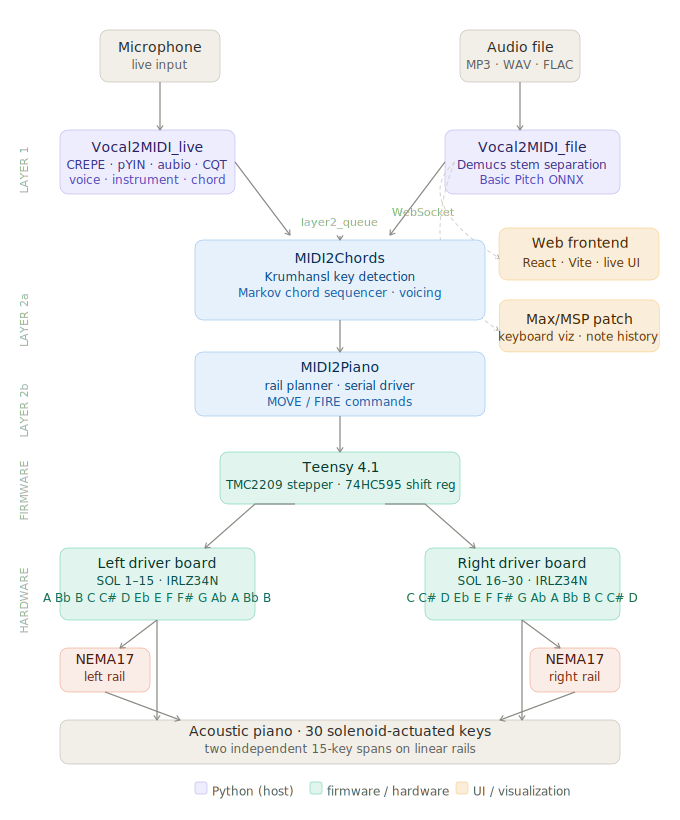

# Vocal2Piano

An external piano exoskeleton that enables real-time robotic accompaniment by tracking and transcribing vocal performances into physical key strikes.

---

## System diagram



---

## How it works

1. **Vocal2MIDI_live** listens to a microphone and converts pitch to MIDI in real time. Three modes: single-note melody instrument, singing/voice, or polyphonic chord input.

2. **Vocal2MIDI_file** takes an uploaded audio file, separates vocals from accompaniment if needed (via Demucs), then transcribes to MIDI (via Basic Pitch ONNX).

3. **MIDI2Chords** reads the live melody notes, figures out the key, picks a chord that fits, and sends voicing targets for each board.

4. **MIDI2Piano** takes those chord notes, works out where each board needs to slide to cover them, and sends `MOVE` / `FIRE` commands to the Teensy over USB serial.

5. **Teensy 4.1** moves the two stepper motors and fires the solenoids.

6. **Max/MSP patch** shows the detected notes and key on a visual keyboard in real time, connected to the Vocal2MIDI_live MIDI virtual port.

7. **Web frontend** lets you record live, upload files, see the pipeline status, and play back original vs MIDI side by side.

---

## Repository structure

```
Vocal2Piano/
├── software/              Python pipeline + React web UI
│   ├── app/               React/Vite frontend
│   ├── engine/            Python scripts
│   │   ├── Vocal2MIDI_live.py
│   │   ├── Vocal2MIDI_file.py
│   │   ├── MIDI2Chords.py
│   │   └── MIDI2Piano.py
│   ├── files/
│   │   ├── input/         uploaded audio (git-ignored)
│   │   └── output/        generated MIDI + stems (git-ignored)
│   └── patch/
│       └── Vocal2MIDI.maxpat    Max/MSP visualization patch
│
├── firmware/              Teensy 4.1 firmware (PlatformIO / C++)
│   ├── platformio.ini
│   └── src/main.cpp
│
└── hardware/
    ├── pcb/               KiCad design files, gerbers, BOM
    └── cad/               Mechanical design, 3D print files
```

---

## Quick start

### Requirements

- Python 3.11
- Node.js 18+
- PlatformIO CLI

### Python environment

```bash
cd Vocal2Piano
python3.11 -m venv .venv
source .venv/bin/activate

pip install sounddevice aubio librosa scipy python-rtmidi websockets
pip install 'basic-pitch[onnx]' onnxruntime
pip install fastapi uvicorn python-multipart
pip install demucs
pip install pyserial

# optional — better live pitch accuracy
pip install crepe tensorflow
```

### Frontend

```bash
cd software/app
npm install
cp .env.example .env    # set VITE_BACKEND_URL=http://localhost:8000
npm run dev             # opens at http://localhost:3000
```

### Firmware

```bash
cd firmware
pip install platformio
pio run --target upload
pio device monitor --baud 115200
# should print: Voice2Piano Teensy ready
```

### Running the full system

Open four terminals:

```bash
# 1 — file conversion server (File tab in web UI)
source .venv/bin/activate
python software/engine/Vocal2MIDI_file.py --server

# 2 — live pitch detection (match the mode selected in the UI)
python software/engine/Vocal2MIDI_live.py --mode instrument --ws
# or: --mode voice  (singing)
# or: --mode chord  (chords/accompaniment)

# 3 — chord generation
python software/engine/MIDI2Chords.py

# 4 — sends commands to Teensy
python software/engine/MIDI2Piano.py --live
```

Open `http://localhost:3000`.

For Max/MSP: open `software/patch/Vocal2MIDI.maxpat`, set the MIDI input to `Voice2Piano_Layer1`.

---

## Hardware

Two driver boards (15 solenoids each) slide on independent linear rails driven by NEMA17 steppers via TMC2209 drivers. A Teensy 4.1 controls both boards and both motors over a single USB connection.

### PCB

See [`hardware/pcb/README.md`](hardware/pcb/README.md) for fabrication files, BOM, and assembly instructions.

### CAD / Mechanical

See [`hardware/cad/README.md`](hardware/cad/README.md) for the full mechanical design, system animation, and 3D printable parts with print settings.

---

## Calibrating rail movement

After flashing the firmware, check that the boards move the right distance:

```bash
# in the Teensy serial monitor:
HOME
MOVE R 12 100
```

Measure the actual travel. It should be 12 × the semitone spacing on your piano (roughly 164mm). If it's off, adjust `STEPS_PER_SEMITONE` in `firmware/src/main.cpp` and reflash.

---

## Training on real music

MIDI2Chords ships with hand-tuned chord transition weights. To replace them with weights learned from actual MIDI files:

```bash
python software/engine/MIDI2Chords.py --train software/files/input/
# writes learned_transitions.json, loaded automatically next run
```

---

## Author

Chenwan Halley Zhong — MS Robotics, Northwestern University