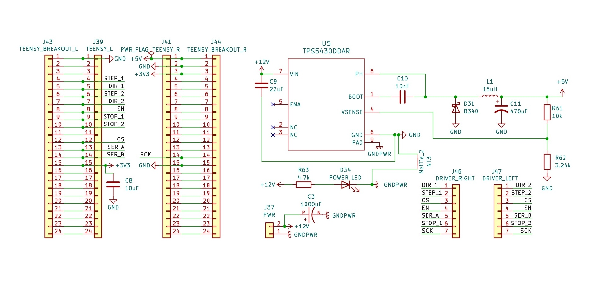
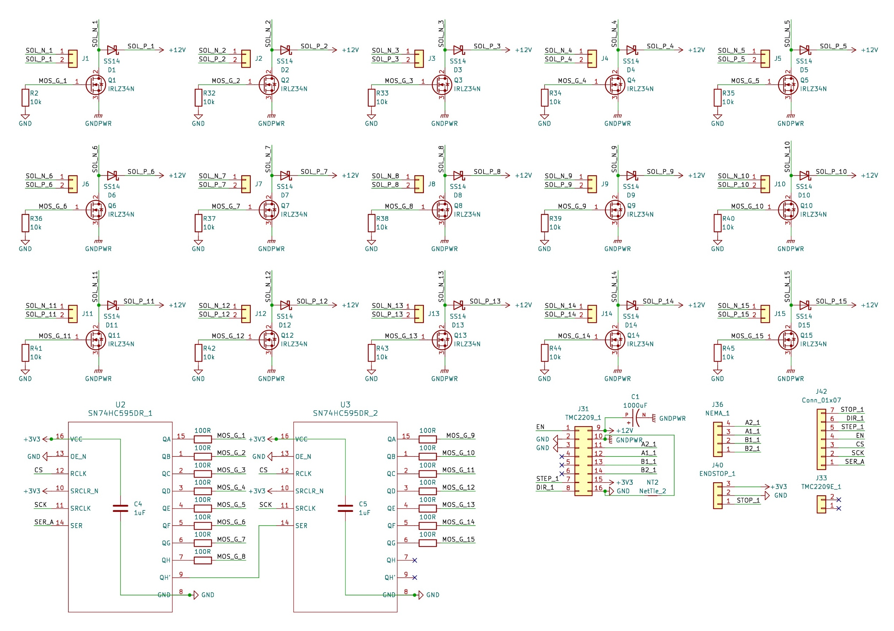
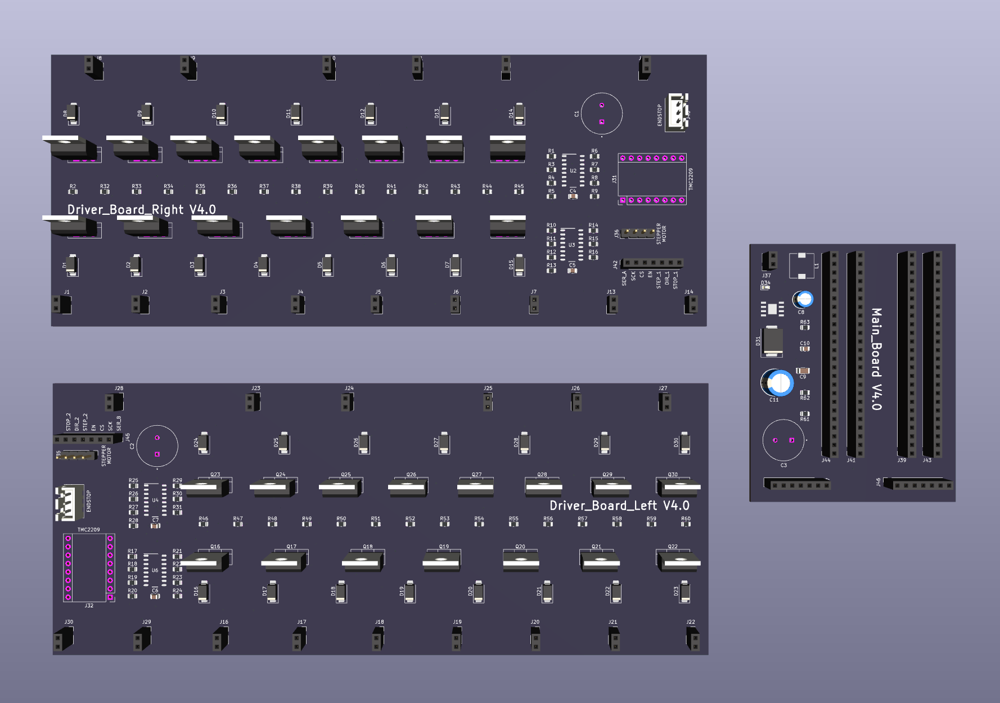

# Vocal2Piano PCB Design

This directory contains the hardware design files for the Vocal2Piano controller board. The system is designed to interface a Teensy 4.1 microcontroller with a 30-channel solenoid driver array and dual stepper motor controllers for automated piano performance.

## Overview

The hardware is split into a modular architecture across the schematic sheets:
* **Main Board:** Integrates a Teensy 4.1 breakout for logic control with a **TPS5430** buck converter. It handles 12V-to-5V power regulation and manages signal distribution across the driver arrays, ensuring stable logic power during high-current solenoid switching.

* **Driver Boards (Left/Right):** 30-channel low-side switch array using **IRLZ34N Logic-Level MOSFETs** driven by **SN74HC595** shift registers.

## Fabrication Instructions

If you intend to manufacture this board (e.g., via JLCPCB or similar services), follow the steps below using the files provided in the `fabrication/` folder.

### PCB Manufacturing
Use the files located in `fabrication/output/`. 
* **Gerber Files:** All `.gbl`, `.gtl`, `.gbs`, `.gts`, etc., define the copper, mask, and silkscreen layers.
* **Drill Files:** `Vocal2Piano-PTH.drl` (Plated Through Hole) and `Vocal2Piano-NPTH.drl` (Non-Plated Through Hole).
* **Board Specifications:**
    * **Layers:** 2
    * **Copper Weight:** Recommended **2oz** (Essential for 50A power distribution).
    * **Material:** FR-4.

### PCBA (Assembly)
For automated assembly, use the CSV files in the `fabrication/` root:
* **BOM (Bill of Materials):** `BOM.csv`. This includes the LCSC part numbers for the MOSFETs, Shift Registers, and Voltage Regulator.
* **CPL (Component Placement List):** `CPL.csv`. This provides the X/Y coordinates and rotation for SMT components.

## Demonstration

### PCB Layout & 3D Render

<!-- ### Physical Assembly -->

